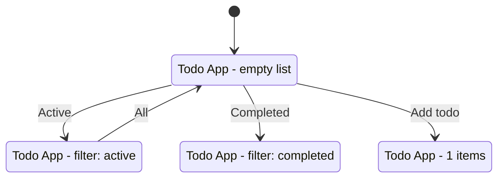

# Graph Module

Data structures and serialization for the state graph representation.

## Overview

This module provides the core data structures for representing application states and transitions as a directed graph, along with serialization utilities for JSON and Mermaid diagram export.

## Components

### StateGraph.ts

The main graph data structure that stores states and transitions.

```typescript
import { StateGraph } from './StateGraph';

const graph = new StateGraph();

// Add states
graph.addState(state);
graph.setEntryState('state_001');

// Add transitions
graph.addTransition({
  id: 'trans_1',
  fromStateId: 'state_001',
  toStateId: 'state_002',
  action: { type: 'click', elementSelector: '[data-testid="btn"]', elementLabel: 'Submit' }
});

// Query the graph
const allStates = graph.getAllStates();
const transitions = graph.getTransitionsFrom('state_001');
const paths = graph.computePaths();

// Export
const json = graph.toJSON();
```

**Key Methods:**

| Method | Description |
|--------|-------------|
| `addState(state)` | Add a state node to the graph |
| `addTransition(transition)` | Add a transition edge (deduplicates) |
| `setEntryState(stateId)` | Mark the entry/initial state |
| `setMetadata(metadata)` | Set graph metadata |
| `getState(stateId)` | Get a state by ID |
| `getAllStates()` | Get all states as array |
| `getTransitions()` | Get all transitions |
| `getTransitionsFrom(stateId)` | Get outgoing transitions |
| `getTransitionsTo(stateId)` | Get incoming transitions |
| `computePaths()` | Calculate paths from entry to all states |
| `toJSON()` | Export as StateGraphData |
| `getStats()` | Get graph statistics |

**Path Computation:**

The `computePaths()` method uses BFS to find all paths from the entry state to each state:

```typescript
const paths = graph.computePaths();
// Returns: Record<stateId, string[][]>
// Example: { "state_002": [["state_001", "state_002"], ["state_001", "state_003", "state_002"]] }
```

### Serializer.ts

Handles conversion between StateGraph and various output formats.

```typescript
import { Serializer } from './Serializer';

// Export to JSON
const json = Serializer.toJSON(graph);

// Save to file
await Serializer.saveToFile(graph, './output/graph.json');

// Load from file
const data = Serializer.loadFromFile('./output/graph.json');

// Generate summary
console.log(Serializer.generateSummary(data));

// Generate Mermaid diagram
console.log(Serializer.generateMermaidDiagram(data));
```

**Output Methods:**

| Method | Description |
|--------|-------------|
| `toJSON(graph)` | Convert graph to JSON string |
| `saveToFile(graph, path)` | Save graph to JSON file |
| `fromJSON(json)` | Parse JSON to StateGraphData |
| `loadFromFile(path)` | Load graph from JSON file |
| `generateSummary(data)` | Create human-readable summary |
| `generateMermaidDiagram(data)` | Create Mermaid state diagram |

## Data Types

### AppState

Represents a single application state:

```typescript
interface AppState {
  id: string;              // Unique identifier (e.g., "state_001")
  url: string;             // Page URL at this state
  domHash: string;         // Hash of DOM structure
  description: string;     // Human-readable description
  elements: InteractiveElement[];  // Discovered elements
  timestamp: number;       // When state was captured
}
```

### StateTransition

Represents a transition between states:

```typescript
interface StateTransition {
  id: string;              // Unique identifier
  fromStateId: string;     // Source state ID
  toStateId: string;       // Target state ID
  action: Action;          // Action that causes transition
}
```

### Action

Represents a user action:

```typescript
interface Action {
  type: ActionType;        // 'click' | 'input' | 'check' | 'select' | 'submit'
  elementSelector: string; // CSS selector for target element
  elementLabel: string;    // Human-readable label
  value?: string;          // Input value (for input/select actions)
}
```

### StateGraphData

The complete serialized graph structure:

```typescript
interface StateGraphData {
  metadata: {
    appUrl: string;
    generatedAt: string;
    totalStates: number;
    totalTransitions: number;
    explorationDurationMs: number;
  };
  states: Record<string, AppState>;
  transitions: StateTransition[];
  paths: Record<string, string[][]>;
  entryStateId: string;
}
```

## Output Formats

### JSON Format

```json
{
  "metadata": {
    "appUrl": "http://localhost:3000",
    "generatedAt": "2024-01-12T10:00:00.000Z",
    "totalStates": 4,
    "totalTransitions": 20,
    "explorationDurationMs": 47000
  },
  "states": {
    "state_001": {
      "id": "state_001",
      "url": "http://localhost:3000/",
      "domHash": "a6a6077e8bb9",
      "description": "Todo App - empty list",
      "elements": [
        {
          "selector": "[data-testid=\"add-btn\"]",
          "type": "button",
          "label": "Add",
          "tagName": "button",
          "attributes": { "id": "add-btn", "type": "submit" }
        }
      ],
      "timestamp": 1705052400000
    }
  },
  "transitions": [
    {
      "id": "trans_1",
      "fromStateId": "state_001",
      "toStateId": "state_002",
      "action": {
        "type": "click",
        "elementSelector": "[data-testid=\"filter-active\"]",
        "elementLabel": "Active"
      }
    }
  ],
  "paths": {
    "state_001": [["state_001"]],
    "state_002": [["state_001", "state_002"]]
  },
  "entryStateId": "state_001"
}
```

### Summary Format

```
============================================================
STATE GRAPH SUMMARY
============================================================

App URL: http://localhost:3000
Generated: 2024-01-12T10:00:00.000Z
Exploration Duration: 47.0s

Total States: 4
Total Transitions: 20
Entry State: state_001

------------------------------------------------------------
STATES
------------------------------------------------------------
  state_001: Todo App - empty list
    URL: http://localhost:3000/
    Elements: 5
  state_002: Todo App - empty list - filter: active
    URL: http://localhost:3000/
    Elements: 5

------------------------------------------------------------
TRANSITIONS
------------------------------------------------------------
  state_001 -> state_002
    Action: click("Active")
    Selector: [data-testid="filter-active"]

------------------------------------------------------------
PATHS FROM ENTRY
------------------------------------------------------------
  To state_002:
    state_001 -> state_002

============================================================
```

### Mermaid Diagram



## Usage Examples

### Creating a Graph Programmatically

```typescript
import { StateGraph } from './StateGraph';
import { Serializer } from './Serializer';

const graph = new StateGraph();

// Add initial state
graph.addState({
  id: 'state_001',
  url: 'http://example.com',
  domHash: 'abc123',
  description: 'Home page',
  elements: [],
  timestamp: Date.now()
});
graph.setEntryState('state_001');

// Add another state
graph.addState({
  id: 'state_002',
  url: 'http://example.com/about',
  domHash: 'def456',
  description: 'About page',
  elements: [],
  timestamp: Date.now()
});

// Add transition
graph.addTransition({
  id: 'trans_1',
  fromStateId: 'state_001',
  toStateId: 'state_002',
  action: {
    type: 'click',
    elementSelector: 'a[href="/about"]',
    elementLabel: 'About'
  }
});

// Set metadata and export
graph.setMetadata({
  appUrl: 'http://example.com',
  generatedAt: new Date().toISOString(),
  totalStates: 2,
  totalTransitions: 1,
  explorationDurationMs: 5000
});

await Serializer.saveToFile(graph, './output/graph.json');
```

### Loading and Analyzing a Graph

```typescript
import { Serializer } from './Serializer';

const data = Serializer.loadFromFile('./output/graph.json');

// Analyze states
console.log(`Total states: ${Object.keys(data.states).length}`);

// Find states with most transitions
const transitionCounts = {};
for (const t of data.transitions) {
  transitionCounts[t.fromStateId] = (transitionCounts[t.fromStateId] || 0) + 1;
}

// Find deadend states (no outgoing transitions)
const deadends = Object.keys(data.states).filter(
  id => !data.transitions.some(t => t.fromStateId === id)
);

console.log('Deadend states:', deadends);
```
